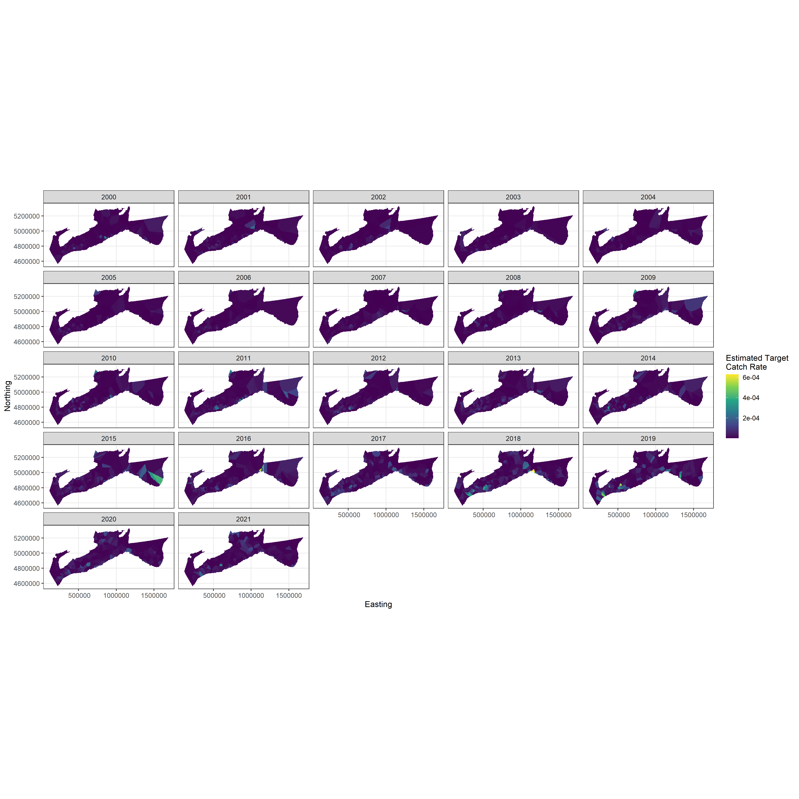
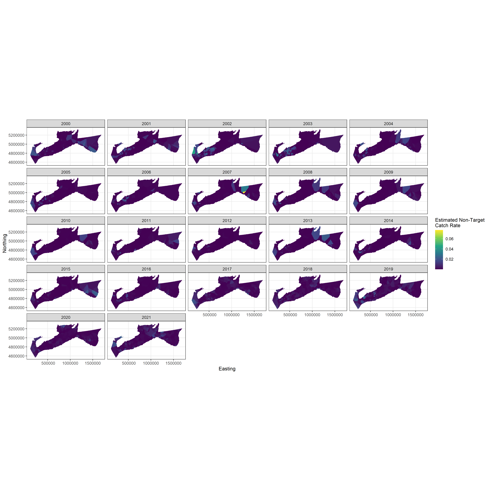

# Results

## Model Validation

Out of the 4 models that were fit to the data, 3 of them (random intercept, random walk and AR(1) process) successfully converged but the model with random slopes gave false convergence and was therefore rejected. The RMSE, AIC and BIC values from this model validation process can be seen in Table \@ref(tab:valid). These values appear to indicate that there is very little difference between the model fits as the RMSE are almost all identical to the $5^{th}$ decimal. According to the AIC and BIC values, the best model would be the random walk as it has the lowest values for both metrics, although the difference is not very large. The model used for all analysis moving forward is therefore the random walk model.

```{r valid, include=F}
load("validation_table.RData")
kableExtra::kable(valid_frame)
```

## Fit to Data

As the best model was considered to be the random walk approach, that model was the one fit to the varying data subsets. Due to issues fitting the 1999 data to the spatial model and to various versions of a spatio-temporal model, the analysis focuses on the data starting in 2000 and does not incorporate the data from 1998 and 1999.

The model successfully converged for all cases, but the fits with the 2017 and onwards data show signs of overparameterization as all of them have atleast 1 variance parameter related to the random intercepts that is estimated arbitrarily close to 0 (see Table \@ref(tab:par-estim)). Most other parameters are estimated very similarly for all fits with the except of $p_{nt}$ and $\mu_{nt}$. $p_{nt}$ is estimated at a very low value when only the fixed stations are included with a correspondingly lower estimate of $\mu_{nt}$, while fits that include the stratified data estimate both parameters at significantly higher values. 

```{r par-estim,include=F}

par_estim_tab<-data.frame(Parameter=c("$p_{nt}$","Anisotropy Parameter 1","Anisotropy Parameter 2","$\\phi_t$","$\\phi_{nt}$","$\\\sigma_t$","$\\sigma_{nt}$","$\\sigma_{vess,t}$","$\\sigma_{vess,nt}$","$\\sigma_{int,t}$","$\\sigma_{int,nt}$","$\\mu_{t}$","$\\mu_{nt}$"),
                          'Both Datasets (Full)'=c("0.788 (0.001)","-0.100 (0.027)","-0.021 (0.025)","0.050 (0.002)","0.048 (0.001)","1.619 (0.032)","1.915 (0.030)","0.760 (0.099)","0.882 (0.091)","0.114 (0.038)","0.293 (0.074)","-12.590 (0.221)","-7.531 (0.384)"),
                          'Fixed Stations (Full)'=c("0.129 (0.009)","-0.081 (0.026)","0.020 (0.026)","0.053 (0.002)","0.060 (0.002)","1.468 (0.032)","1.599 (0.029)","0.601 (0.083)","0.744 (0.088)","0.185 (0.048)","0.078 (0.058)","-12.866 (0.264)","-9.432 (0.202)"),
                          'Both Datasets (2017+)'=c("0.881 (0.0005)","-0.131 (0.095)","-0.019 (0.066)","0.054 (0.005)","0.015 (0.002)","1.956 (0.085)","1.493 (0.038)","0.735 (0.228)","0.746 (0.108)","0.0003 (0.043)","0.158 (0.119)","-12.012 (0.181)","-6.319 (0.225)"),
                          'Fixed Stations (2017+)'=c("0.246 (0.015)","-0.186 (0.079)","0.129 (0.077)","0.060 (0.007)","0.046 (0.005)","1.408 (0.080)","1.582 (0.074)","0.485 (0.174)","0.748 (0.187)","0.00010 (0.083)","0.233 (0.220)","-11.133 (0.174)", "-9.559 (0.381)"),
                          'Stratified Data (2017+)'=c("0.903 (0.0005)","-0.085 (0.090)","-0.147 (0.078)","0.058 (0.007)","0.051 (0.005)","1.985 (0.101)","0.885 (0.029)","0.505 (0.214)","0.624 (0.092)","0.00005 (0.030)","0.0002 (0.038)","-12.262 (0.164)","-6.015 (0.117)"))

kableExtra::kable(par_estim_tab)

```

The distribution of vessel effects are very similar between model fits, with more variability and a wider distribution when more data is incorporated (i.e., fits with just the fixed stations or just the stratified data from 2017 onwards tend to have lower variance and tighter distribution, see Figure \@ref(fig:vess-eff)).

```{r vess-eff,echo=F,fig.ncol=2,out.width="75%",fig.align="center",dpi=200,fig.show="hold",fig.cap = "MAKE A CAPTION"}
knitr::include_graphics(c("vess_eff_t_walk.png","vess_eff_nt_walk.png"))
```

The overparameterization of fits that only contain data from 2017 onwards is very visible in Figure \@ref(fig:rand-int) where most intercepts do not vary over time due to the model not being able to estimate the variance around them. For the fits that have data starting in 2000, there are clear changes over time in the random intercepts. Non-target species intercepts are always lower when only the fixed stations are considered, as expected with the difference in the estimated value of $p_{nt}$. However, the inclusion of data from the stratified design also seems to make the model capture an increase in overall average expected non-target catch rates starting in 2016 which does not show up when only the fixed data are included. 

The pattern for the target species (halibut) are a lot more similar between model fits, with both capturing an overall increase in expected catch rates over the time series. However, the fit with just the fixed stations has a slightly higher increase.

```{r rand-int,echo=F,fig.ncol=2,out.width="75%",fig.align="center",dpi=200,fig.show="hold",fig.cap = "MAKE A CAPTION"}
knitr::include_graphics(c("rand_int_walk.png","rand_int_2017_walk.png"))
```

For the indices themselves ($\lambda_t$ and $\lambda_{nt}$), there are large differences when looking at the fits that only include data from 2017 onwards (Figure \@ref(fig:target-indices)). The fit with just the fixed stations has a completely different pattern than the other 2 fits. Those other 2 fits have similar trends, but the estimates when both datasets are included are more than twice as large as when just the stratified data is included. However, as all these fits are from a model that is overparameterized for the length of time present in the data, it is difficult to find clear links between the datasets and the modelling output.

For the fits that incorporate data starting in 2000, the trends between the two fits are very similar but the fit with both datasets always has larger indices than the one with just fixed stations. This matches up with the fits that estimate $p_{nt}$ at very low value (fixed stations), which would indicate that the model implicitly assumes that the abundance of non-target species is much larger than just the number of non-target species caught would indicate.

```{r target-indices,echo=F,fig.ncol=2,out.width="75%",fig.align="center",dpi=200,fig.show="hold",fig.cap = "MAKE A CAPTION"}
knitr::include_graphics(c("comp_all_ldat_2017_walk.png","comp_all_ldat_walk.png"))
```
While having a lower $p_{nt}$ implicitly means that the model considers there to be a lot more non-target species than capture, this does not result in higher non-target estimated catch rates but rather in lower ones (Figure \@ref(fig:non-t-indices)). This is because these non-target species are considered to be significantly more likely to escape, meaning that a lot more of them need to come around for one to be caught, which will result in lower catch rates.

```{r non-t-indices,echo=F,fig.ncol=2,out.width="75%",fig.align="center",dpi=200,fig.show="hold",fig.cap = "MAKE A CAPTION"}
knitr::include_graphics(c("comp_all_ldant_walk.png","comp_all_ldant_2017_walk.png"))
```

Looking at the outcomes spatially for the fit with both datasets, the locations of halibut high catch rates appear to generally focus around the Scotian Shelf in the western part of the modelled area, with some spikes around the Laurentian Channel in the middle and a few isolated spikes on the eastern edge of the modelled area (Figure \@ref(fig:target-spat)). For non-target catch rates, the highest spikes are consistently located on the western edge of the area towards the Gulf of Maine and the Bay of Fundy, with other less common spikes located east of the Laurentian Channel. The spatial outcomes from the fit with just the fixed stations has similar patterns (figures in Appendix B).

```{r target-spat,echo=F,fig.ncol=1,out.width="75%",fig.align="center",dpi=200,fig.show="hold",fig.cap = "MAKE A CAPTION"}

```

```{r non-target-spat,echo=F,fig.ncol=1,out.width="75%",fig.align="center",dpi=200,fig.show="hold",fig.cap = "MAKE A CAPTION"}

```

## Persistence

The persistence index of the spatial pattern for target species (halibut) indicate that the fixed stations are extremely likely (>98%, see table in @Li2015) to capture the changes over time of this population abundance as the index is extremely low for all combination of years. However, the persistence of non-target species exhibits a different pattern wherein there appears to be a spatial shift in their distribution between early in the time series (mid-2000s) and the peak abundance late in the time series (2017 to 2020). This would represent a high chance that the fixed stations would miss changes in their distribution which, due to the nature of the multinomial model, would impact the estimation of target catch rates. Figure \@ref(fig:rand-int) shows some evidence of this happening in that the expected catch rate for non-target species increases in the late 2010s when the stratified data is included, but not when only the fixed stations are analyzed.

```{r persist,echo=F,fig.ncol=2,out.width="75%",fig.align="center",dpi=200,fig.show="hold",fig.cap = "MAKE A CAPTION"}
knitr::include_graphics(c("persist_raster_plot_walk.png","persist_nt_raster_plot_walk.png"))
```

