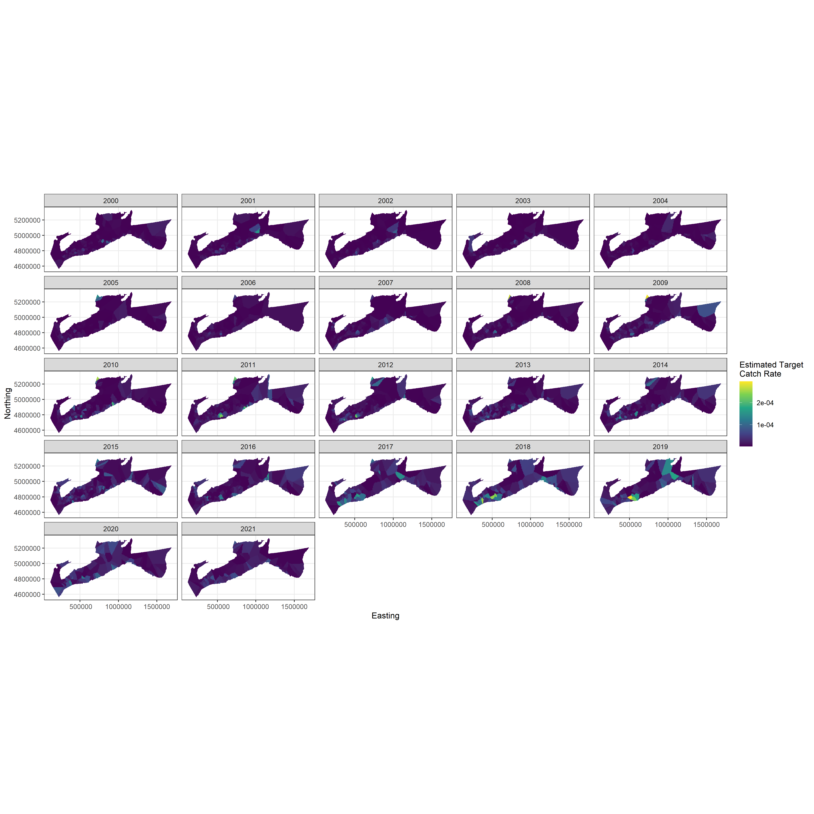
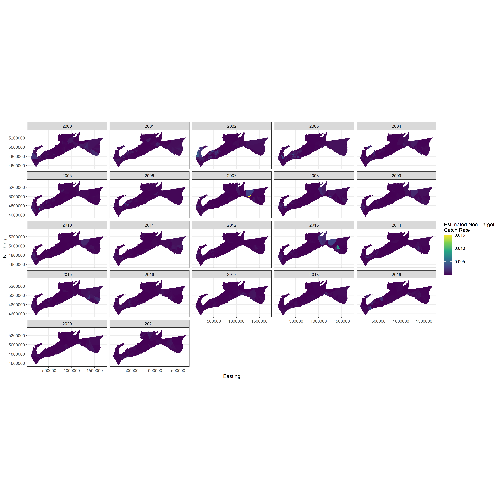

<!-- The following code should appear at the beginning of the first appendix.
(if you have one)
After that, all subsequent sections will be turned into appendices. -->

`r if(knitr:::is_latex_output()) '% begin csasdown appendix'`
`r if(!knitr:::is_latex_output()) '# (APPENDIX) Appendix {-}'`

\clearpage

# {#app:first-appendix}

\flushright{2 September 2021}

\centering
\textbf{Terms of Reference (TOR)}
\flushleft

Statistical innovations for obtaining and validating Atlantic halibut longline survey indices of exploitable biomass through implementation of a multinomial, hook occupancy model.

**Estimated Value**

The total value of any contract(s) emanating from this TOR is $10000 (4 months).

**Objectives of the Requirement**

To extend the proposed spatial modeling to include the fix station and explore spatial temporal model to provide an index over time from the beginning of the survey until current time.

**Background, Assumptions and Specific Scope of the Requirement**

Together, the Atlantic Halibut Council and the Department of Fisheries and Oceans Canada (DFO) have used an annual longline survey to monitor Atlantic halibut exploitable biomass since 1988. The survey was originally stratified into areas of Low, Medium and High catch based on data from commercial fishing logs (1995-1997). Stratified estimates were used until the assessment by Trzcinski et al. (2009) when the stratification system was no longer utilized (although the strata were still part of the survey design). Starting in 2009, a standardized catch rate calculated from a negative binomial (NB) generalized linear model (GLM) replaced the stratified estimate of mean weight per standard longline set (den Heyer et. al., 2013).

The simple stratified mean adjusted catch rate and the NB GLM both assume that halibut are the only species being caught by the longline hooks with no accounting for other species competing for hooks. In addition, these methods implicitly assume that all hooks that do not have halibut would still have been able to catch halibut had there been more of these fish in the area. However, some number of hooks will be occupied by species other than halibut and other hooks will be empty with bait still attached or missing. Smith (2016) recently recommended replacing the NB GLM with a multinomial model that accounted for both the number of halibut caught, and the number of hooks occupied by other species or missing bait.

The Atlantic halibut longline survey was designed to provide an annual index of abundance (numbers or weights) to monitor the status of the stock for management purposes. Based on the work has been done by now, it is useful to extend that spatial modeling to include the fix station as well, also explore spatial temporal model to provide an index over time from the beginning of the survey until current time. In other words, we will have one index to include in our assessment model for the longline survey data both from fixed station and stratified random.

**Tasks, Activities and Deliverables**

The deliverables for the project will be to:

1) Develop spatiotemporal multinomial model for stratified random station survey 2017-2020

2) Develop spatiotemporal multinomial model for the fixed station survey data 1998-2020 (app 230 station 1998-2016 and 100 stations 2017-2020)

3) Develop a spatiotemporal model that simultaneously analyzes the data from the four years, 2017-2020, for which there are both fixed and stratified random station data.

4) Develop a spatiotemporal model for the entire time series, 1998-2020, of fixed station and random survey data

5) A technical report.

**Expected Start and Completion Dates**

All work will be completed between September 2021 and January 2022. The weekly number of hours worked will vary over that timeframe, as agreed upon between DFO and Dalhousie University (Dr. Joanna Mills Flemming).

**Contingencies**

If the tasks/deliverables are in jeopardy due to unforeseen circumstances such as student leaving the project or because of other complications or poor work quality, the Scientific Authorities will proceed with the project goals through contracts to other students and/or conduct the analyses themselves.

**Reporting Requirements**

1. Basic updates from the student on how work is progressing are required weekly by email or phone with the Scientific Authorities.

2. At the end of work, a detailed report, relating the progress of the project with respect to the identified deliverables, will be provided to the Project Authorities. This report must be sufficiently detailed that the Project Authorities are able to evaluate whether the progress of the project is sufficient that contingency plans, as outlined above, do not need to be implemented.

**Change Management Procedures**

Changes to the scope of the project will be made through agreement by all parties and documented through email correspondence.

**Other Terms and Conditions**

Authorities

Scientific Authorities

Dr. Joanna Mills Flemming and Dr. Bruce Smith

Department of Mathematics and Statistics | Dalhousie University

902-494-2572 PO Box 15000 | Halifax NS B3H 4R2 Canada

Contracting Authority (Dalhousie University)

Miriam Breslow

HR Advisor, Academic Staff Relations

Human Resources | Dalhousie University

902-494-2965

Henry Hicks Administration Building, Room 150

PO Box 15000 | Halifax, NS B3H 4R2 Canada

Project Authorities (DFO and Atlantic Halibut Council)

Dr. Lingbo Li and Dr. Cornelia (Nell) den Heyer

Population Ecology Division, Science Branch,

Fisheries and Oceans Canada,

P.O. Box 1006, Dartmouth, NS B2Y 4A2

Brendan.Wringe@dfo-mpo.gc.ca

Mr. Bruce Chapman

Atlantic Halibut Council

bchapman@sympatico.ca

**DFO and Atlantic Halibut Council Obligations**

DFO and the Atlantic Halibut Council will provide all relevant fisheries and biological data and access to staff members or fishers who will be available for advice on, and participate in, the proposed activities. DFO will provide training in the data and current modelling procedures as background to the work.

**Location of Work**

Work will be conducted at Dalhousie University or with the other parties as expertise or third-party funding sources requires.

**Remuneration**

Invoicing will be monthly; an initial invoice in September 2021 and a final invoice in January 2022.

**References**

Armsworthy, S, Wilson, S, Mohn, R. 2006. Atlantic halibut on the Scotian Shelf and Southern Grand Banks (NAFO Division 3NOPs4VWX5Zc) – Industry/DFO longline survey results to 2005. DFO Can. Sci. Advis. Sec. Res. Doc. 2006/065: ii +31p.

den Heyer, C, Schwarz, C, and Trzcinski, M. 2013. Fishing and natural mortality rates of Atlantic halibut estimated from multiyear tagging and life history. Trans. Am. Fish. Soc. 143(3): 690-702.

Etienne, M, Obradovich, S, Yamanaka, K, and McAllister, M. 2013. Extracting abundance indices from longline surveys: a method to account for hook competition and unbaited hooks. arXiv 1005.0892v3:1-35.

Smith, S. 2016. Review of the Atlantic halibut longline survey index of exploitable biomass. Canadian Technical Report of Fisheries and Aquatic Sciences 3180.

Thorson, J, Ianelli, J, Munch, S, Ono, K, Spencer, P. 2015b. Spatial delay-difference models for estimating spatiotemporal variation in juvenile production and production abundance. Can. J. Fish. Aquat. Sci. 72 (12), 1897-1915. doi: 10.1139/cjfas-2014-0543.

Thorson, J, Skaug, H, Kristensen, K, Shelton, A, Ward, E, Harms, J, Benante, J. 2015a. The importance of spatial models for estimating the strength of density dependence. Ecology 96 (5), 1202–1212. doi: 10.1890/14-0739.1.sm

Thorson, J, Shelton, A, Ward, E., Skaug, H. 2015c. Geostatistical delta-generalized linear mixed models improve precision for estimated abundance indices for West Coast groundfishes. ICES J. Mar. Sci. 72, 1-11. doi: 10.1093/icesjms/fst176.

Trzcinski, M, Armsworthy, S, Wilson, S, Mohn, R, Fowler, M and Campana, S. 2009. Atlantic halibut on the Scotian Shelf and Southern Grand Banks (NAFO Division 3NOPs4VWX5Zc) – Industry/DFO longline survey and tagging results to 2008. DFO Canadian Scientific Advisory Sec. Res. Doc. 2009/026: vi +43p

\clearpage

# {#app:second-appendix}

```{r target-spat-fixed,echo=F,fig.ncol=1,out.width="100%",fig.align="center",dpi=200,fig.show="hold",fig.cap = "Station-specific estimated target species catch rates obtained using data from only the fixed stations."}

```

```{r non-target-spat-fixed,echo=F,fig.ncol=1,out.width="100%",fig.align="center",dpi=200,fig.show="hold",fig.cap = "Station-specific estimated non-target species catch rates obtained using data from only the fixed stations."}

```

<!-- At the end of your appendices add: -->
`r if(knitr:::is_latex_output()) '% end csasdown appendix'`
